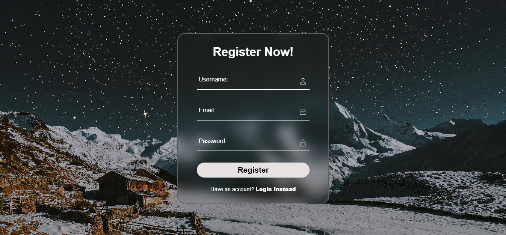
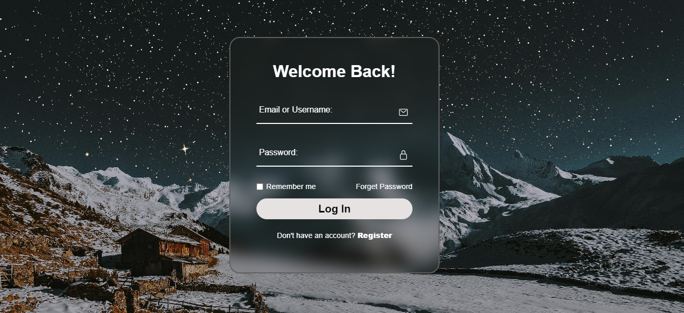
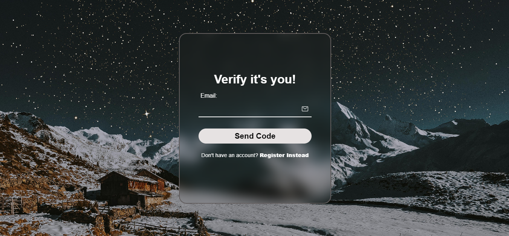

# 🛡️ Flask User Authentication and Password Recovery

Welcome to the **Flask User Authentication and Password Recovery** project! This application showcases a robust user management system, including features such as registration, login, and password recovery. Whether you're building a web app or learning Flask, this project serves as a comprehensive guide to implementing secure user authentication systems.

## 🚀 Features

- **🔑 User Registration**: Create an account with a unique username and email. Passwords are securely hashed using PBKDF2 with SHA-256 for maximum security.

- **🔒 User Login**: Log in using your email or username and password. Sessions are managed securely using Flask-Login.

- **🛡️ Password Recovery**: Forgot your password? No worries! Request a recovery code sent directly to your email and reset your password with ease.

- **🔐 Protected Routes**: Access a secret page that only authenticated users can view. Perfect for learning about route protection in Flask.

- **📄 File Download**: Download a file from the server, available only to logged-in users. This feature demonstrates file handling and user access control.

## 🛠️ Technologies Used

- **Flask**: A lightweight web framework for Python that simplifies the development of web applications.
- **SQLAlchemy**: An ORM (Object-Relational Mapping) tool for Python that provides a flexible and efficient way to interact with databases.
- **Flask-Login**: A Flask extension for managing user sessions and authentication seamlessly.
- **Werkzeug**: A comprehensive WSGI web application library used here for password hashing and security.
- **SMTP**: Simple Mail Transfer Protocol used for sending recovery emails via Gmail.

## 📸 Screenshots

### Registration Page


### Login Page


### Password Recovery



> **Note:** Replace the placeholder images above with actual screenshots of your application to give potential users a visual walkthrough.

## 💡 Skills Gained

Working on this project, I acquired several valuable skills, including:

1. **Web Development with Flask**: Gained a strong understanding of how to build web applications using Flask, including route management, templating, and form handling.

2. **Database Management with SQLAlchemy**: Learned how to define and manipulate data models using SQLAlchemy, manage database migrations, and perform CRUD operations.

3. **User Authentication**: Implemented user authentication systems using Flask-Login and learned best practices for password hashing and security.

4. **Email Integration**: Integrated SMTP for sending emails, allowing for real-world applications such as password recovery and user notifications.

5. **Security Best Practices**: Gained insights into securing web applications, including password hashing, session management, and protecting routes from unauthorized access.

6. **Deployment**: Prepared the application for deployment, including managing environment variables and configuring the application for production use.

## 📚 Installation

### 1. Clone the Repository

```bash
git clone https://github.com/yourusername/flask-user-authentication.git
cd flask-user-authentication
